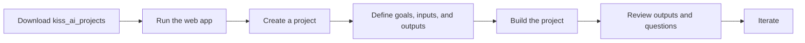

# kiss_ai

## Apple / Mac Computer

Just run this:

```sh
curl -fsSL https://raw.githubusercontent.com/all-hail-ai/kiss_ai/main/scripts/install-mac.sh | bash
```

`kiss_ai` is a local web application for creating, managing, and evolving AI-assisted research projects.

The web app is the primary interface. It replaces working directly in Cursor and Obsidian for day-to-day project work. Behind the scenes, the app stores project files locally and uses Cursor CLI agent runs through its API layer.

The normal workflow is:



## Folder Layout

Keep `_kiss_ai/` beside your research projects:

```text
kiss_ai_projects/
  _kiss_ai/              # web app, shared framework, docs, and examples
  your_project_name/     # one research project
  another_project/       # another research project
```

Research projects should be siblings of `_kiss_ai/`, not inside it. Each research project has its own saved history so the agent can track changes and annotations safely.

## Quick Start

1. Put the `kiss_ai_projects` folder somewhere easy to find.
2. Install Node.js 20 or newer from <https://nodejs.org/>.
3. Start the web app from `_kiss_ai/web/`:

```sh
cd _kiss_ai/web
npm install
npm run dev
```

4. Open the local web app in your browser.
5. Use the app to create or select a project.
6. Follow the left-side workflow: define requirements, build the project, review source data, and review outputs.

Read the setup guide for your computer:
   - [Mac setup](docs/setup-mac.md)
   - [Windows setup](docs/setup-windows.md)

If something goes wrong, use [Troubleshooting](docs/troubleshooting.md). For terminology, see the [Glossary](docs/glossary.md).

## How You Work

In the web app, you work through screens instead of managing raw files directly:

- **Chat:** ask project questions and request help.
- **Define the requirements:** describe goals, source needs, outputs, and open questions.
- **Build the project:** run or monitor the AI build process.
- **Source data view:** review source material and AI-prepared source notes.
- **Outputs built:** review generated reports, wiki pages, and other deliverables.

The app stores this work in local project files such as `human_goal_requirements.md`, `inputs_ai/`, `outputs_ai/`, and `change_logs/`. Those files are implementation details for normal users, but they remain available for advanced review and troubleshooting.

## Agent Runtime

The web app calls local API routes, and those routes launch Cursor CLI agent work behind the scenes. Users should normally start builds from the web app, not by pasting command files into Cursor.

The shared framework lives in `_kiss_ai/framework/`. Maintainers may see command paths such as:

```text
../_kiss_ai/framework/commands/do_all_rebuild.md
```

Do not copy or recreate a `framework/` folder inside each research project.

## Advanced Direct File Access

Direct Cursor or filesystem access is useful for maintainers, debugging, or recovery. It is not the main user workflow.

Runtime settings:

- `KISS_AI_PROJECTS_ROOT` overrides the projects folder. By default, the hub looks two levels above `web/`.
- `CURSOR_API_KEY` enables web-app-triggered Cursor agent runs. The server also checks `web/.env` and the macOS Keychain item `cursor_api_key`.
- `KISS_AI_UI_PORT` controls the Express API port.
- `CURSOR_MODEL` optionally controls the Cursor model selection.

## Privacy

Your project data stays local unless you choose to upload, publish, or share it. Do not put private client, patient, employer, or personal data into public repositories.

## More Documentation

Use the [Documentation map](docs/documentation-map.md) to find user guides, examples, template docs, and maintainer references.
