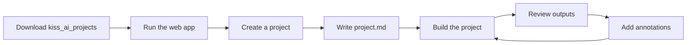

# kiss_ai

## Apple / Mac Computer

Just run this:

```sh
curl -fsSL https://raw.githubusercontent.com/allhailai/kiss_ai/master/scripts/install-mac.sh | bash
```

`kiss_ai` is a local web application for creating, managing, and evolving AI-assisted research projects.

The web app is the primary interface. Behind the scenes, the app stores project files locally and uses Cursor CLI agent runs through its API layer.

The normal workflow is:



## Folder Layout

Keep `_kiss_ai/` beside your research projects:

```text
kiss_ai_projects/
  _kiss_ai/              # web app, shared framework, docs, and examples
  your_project_name/     # one research project
  another_project/       # another research project
  .kiss_ai_settings.json # optional settings (mode, keybindings, session config)
  .kiss_ai_auth.json     # auth data (server mode only, auto-generated)
```

Research projects should be siblings of `_kiss_ai/`, not inside it.

## Project Structure

Each project has a simple file layout:

```text
my_project/
  project.md                 # Your project brief (the one file you write)
  human_design_identity.md   # Visual identity and design preferences
  questions.md               # Open questions needing your input
  inputs_human/              # Your documents, notes, PDFs
  sources/                   # AI's evidence cache
    source_log.md            # What was gathered, freshness, gaps
    web_research/            # Downloaded web content
    extracted/               # Extracted content from your files
  outputs_ai/                # The deliverables
    wiki/                    # Research wiki
    reports/                 # Dated reports
    ...                      # Other directed outputs
  .build/                    # Build machinery
    manifest.json            # Build record
  change_logs/               # Build history
    builds.md
```

## Quick Start

1. Put the `kiss_ai_projects` folder somewhere easy to find.
2. Install Node.js 20 or newer from <https://nodejs.org/>.
3. Start the web app from `_kiss_ai/web/`:

```sh
cd _kiss_ai/web
npm install
npm run dev
```

4. Open the local web app in your browser.
5. Use the app to create or select a project.
6. Edit `project.md` to describe your goal, topics, and desired outputs.
7. Build the project and review outputs.

Read the setup guide for your computer:
   - [Mac setup](docs/setup-mac.md)
   - [Windows setup](docs/setup-windows.md)

If something goes wrong, use [Troubleshooting](docs/troubleshooting.md). For terminology, see the [Glossary](docs/glossary.md).

## How You Work

1. **Write `project.md`** — describe your goal, context, topics, and what outputs you want.
2. **Add documents** to `inputs_human/` — optional notes, PDFs, data files.
3. **Build the project** — the AI gathers sources, builds a wiki, and creates your directed outputs.
4. **Review outputs** — read the wiki and reports in the web app.
5. **Add annotations** — use the [+] button to give feedback on any AI output.
6. **Build again** — the AI applies your feedback and refreshes with latest data.

## Annotations

When reviewing AI-generated outputs, you can add feedback using the [+] annotation button:

- **Blue annotations (FEEDBACK)** — your feedback to the AI. Applied on the next build.
- **Green annotations (AI_SUGGESTION)** — AI suggestions for improvements. Accept, dismiss, or modify.

This replaces the old git-diff annotation system. Annotations are explicit, visible, and intentional.

## Framework Commands

The shared framework lives in `_kiss_ai/framework/`. Three commands:

- `do_build.md` — Build the project (the main command).
- `do_assist.md` — AI Assist for editing project.md and drafting annotations.
- `do_init_project.md` — Create a new project from template.

## Operating Modes

kiss_ai supports two operating modes: **standalone** (default) and **server**.

### Standalone Mode (Default)

This is how kiss_ai works out of the box. No login, no passwords — the app runs locally on your machine and binds to `127.0.0.1` (localhost only). Anyone with access to your computer can use the app.

No configuration is needed. If you do not set a mode, standalone is used.

### Server Mode

Server mode adds authentication and allows the app to serve multiple users on a network. Use this when kiss_ai is installed on a shared machine (e.g., a classroom server, a team workstation, or a cloud VM behind a reverse proxy).

**What changes in server mode:**

| Feature | Standalone | Server |
|---|---|---|
| Login required | No | Yes |
| User management | N/A | Admin UI in Settings |
| Bind address | `127.0.0.1` (local only) | `0.0.0.0` (all interfaces) |
| System admin routes | Open | Admin only |
| SPA serving | Vite dev server | Express serves built `dist/` |
| Trust proxy | Off | On (for load balancer) |

#### Enabling Server Mode

Set the mode in one of two ways (environment variable takes precedence):

**Option A: Environment variable**

```sh
export KISS_AI_MODE=server
```

**Option B: Settings file**

Add `"mode": "server"` to `.kiss_ai_settings.json` in your `kiss_ai_projects/` root:

```json
{
  "mode": "server",
  "keybindings": { ... }
}
```

#### Setting the Admin Password

Server mode requires an admin password. There is no default password — the server **refuses to start** without one on first boot.

**On first boot**, set the password via environment variable:

```sh
export KISS_AI_ADMIN_PASSWORD="your-secure-password"
KISS_AI_MODE=server npm start
```

The password is hashed and stored in `.kiss_ai_auth.json`. The `KISS_AI_ADMIN_PASSWORD` env var is only needed for the initial setup.

**To change the admin password later**, use the CLI script on the server box:

```sh
node _kiss_ai/scripts/set-admin-password.js
```

There is no API endpoint to change the admin password — this requires shell access to the server.

#### Running in Server Mode (Production)

For production, build the frontend first and run the Express server:

```sh
cd _kiss_ai/web
npm install
npm run build        # builds the SPA to dist/
npm start            # runs Express, serves API + SPA
```

The app will be accessible at `http://<server-ip>:8787`. For HTTPS, place a reverse proxy (e.g., Nginx) in front of the Express server to terminate TLS.

#### User Management

The default admin user is `kissai_admin`. Once logged in as admin:

1. Open **Settings** (from the project picker).
2. Click **Manage Users**.
3. Add, edit, or delete users from the admin panel.

User fields: username, password, first name, last name, admin status.

**Rules:**
- `kissai_admin` cannot be edited or deleted via the UI — admin password changes require the CLI script.
- Deleting a user or changing their password immediately invalidates their session.
- Demoting an admin takes effect on their next request.

#### Session Configuration

Sessions use a sliding window. Each authenticated request extends the session. Configure the window in `.kiss_ai_settings.json`:

```json
{
  "mode": "server",
  "session_expiry_days": 3
}
```

Default is 3 days. If a user is idle longer than this, they must log in again.

## Agent Runtime

The web app calls local API routes, and those routes launch Cursor CLI agent work behind the scenes. Users should normally start builds from the web app.

Runtime settings:

- `KISS_AI_PROJECTS_ROOT` overrides the projects folder.
- `CURSOR_API_KEY` enables web-app-triggered agent runs.
- `KISS_AI_UI_PORT` controls the Express API port (default: `8787`).
- `CURSOR_MODEL` optionally controls the model selection.
- `KISS_AI_MODE` sets the operating mode: `standalone` (default) or `server`.
- `KISS_AI_ADMIN_PASSWORD` sets the initial admin password (server mode, first boot only).

## Migration

If you have projects created with the v1 architecture (three requirement files, `.harness-state.json`), see [migration.md](migration.md) for how to convert them.

## Privacy

Your project data stays local unless you choose to upload, publish, or share it. Do not put private client, patient, employer, or personal data into public repositories.

In server mode, user credentials (hashed passwords) are stored in `.kiss_ai_auth.json` in the projects root. This file should not be committed to version control.

## More Documentation

Use the [Documentation map](docs/documentation-map.md) to find user guides, examples, template docs, and maintainer references.
