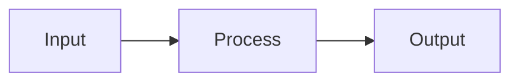

# do_build_file

Build or rebuild a single report for a kiss_ai research project.

This command is called by the build pipeline for each report file the user selects to build. It receives a focused context containing only the sources, wiki pages, and requirements relevant to this specific report. Your job is to write ONE report file with maximum depth and specificity.

## Non-Interactive Runtime Contract

This is a web-triggered build. Never ask for confirmation or wait for input. When a decision is needed, choose the conservative default and leave an `<!-- AI_SUGGESTION: ... -->` marker explaining what the user should review.

## Instructions

### Step 1: Read Provided Context

The build pipeline has already prepared the following context for you:

1. **Output requirements** — The relevant sections of `project.md` that describe this output type, its required structure, tone, and citation standards.
2. **Wiki pages** — The compiled wiki pages relevant to this report (already built in a prior knowledge build). These contain synthesized analysis from the full source base.
3. **Full source files** — The complete text of source files directly relevant to this report. These contain the raw evidence: specific data points, named entities, regulatory citations, contractual details, and other specifics.
4. **Source digests** — Compact key-claim summaries of additional sources.
5. **Open questions** — Relevant open questions from `questions.md`.
6. **Human inputs** — Any human context files from `inputs_human/`.

### Step 2: Read Existing Content (if rebuilding)

If the output file already exists, **read it first**. The existing content represents the user's structural preferences and any edits they have made.

**Treat user edits as feedback:**
- If the user has added, removed, or reordered sections — honor those structural decisions.
- If the user has changed emphasis, tone, or depth in certain areas — preserve that intent.
- If the user has added inline notes or comments — incorporate their guidance.
- The user's edits are NOT content to preserve verbatim. They are signals about what the user wants. Refresh all data-driven content from current wiki and sources while respecting the user's structural and editorial choices.

When no existing file exists, this is a first build — generate the full report from scratch based on the output requirements.

### Step 3: Write the Output File

Write the report file at the exact path specified in the prompt (e.g. `outputs_ai/reports/strategy_overview.md`). Do NOT nest it inside an additional directory — write to the exact path given. Follow the structure defined in the output requirements.

**Depth requirements — every report must include:**

- **Named entities**: Specific names, identifiers, codes, and labels. Never use generic descriptions when specific names are available in the sources.
- **Specific dates**: Relevant dates from sources. If the source provides a date, include it.
- **Regulatory/legal citations**: Where applicable, cite specific sections, clauses, or standards rather than general references.
- **Consequences and risks**: Each risk or concern must state what happens and what can be done about it.
- **Actionable content**: Recommendations and steps must be specific enough to act on without further research.

**When rebuilding an existing report:**
- Preserve the user's structural choices (headings, section order, emphasis areas) while updating data, claims, and citations from current sources.
- If the user has added or removed sections, honor those decisions.
- If the user has changed the depth or focus of a section, maintain that emphasis.
- Refresh all data points, statistics, and factual claims from current wiki pages and source files.

### Step 4: Citation Standards

- Cite wiki pages with relative links: `[topic-name](../wiki/topic-name.md)`
- Cite source files with relative links: `[source](../../sources/digests/source_name.md)` or `[source](../../sources/web_research/source_name.md)`
- Cite both source files and wiki articles when a conclusion depends on synthesis across multiple sources.
- If sources conflict, cite both and explain the conflict.
- If a data point cannot be confirmed from sources, label it as unverified.

### Step 5: Visual Elements — Mermaid Diagrams

When a concept, process, or data breakdown benefits from visual representation, use fenced Mermaid code blocks:

````markdown

````

The viewer renders these inline as SVG diagrams. Use Mermaid for:
- **Flowcharts** — decision trees, process flows, causal chains
- **Pie charts** — allocation breakdowns, portfolio composition
- **Sequence diagrams** — interaction timelines, protocol exchanges
- **Mindmaps** — concept hierarchies, topic relationships

Keep diagrams focused and labeled. Prefer Mermaid over text-based ASCII art. Do not use Mermaid for simple lists or tables — use standard markdown for those.

### Step 6: Quality Gate

Before finishing, verify:

- [ ] Every section has substantive content (not just a heading and a link).
- [ ] Every factual claim cites a source file, wiki page, or URL.
- [ ] Unsourced claims are explicitly marked as unverified.
- [ ] The report opens with a BLUF (Big Idea Up Front) executive summary.
- [ ] Open questions are listed inline with priority and blocking status.
- [ ] The report follows any rules in `project.md` > Output Guidance.
- [ ] The report follows any constraints in `project.md` > Constraints.

## What NOT to Do

- Do not write wiki pages. They are already built.
- Do not update `manifest.json`, `questions.md`, `.build/questions.json`, or `change_logs/`. The orchestrator handles those.
- Do not run git commands.
- Do not generate other output files — only the one file specified in the prompt.
- Do not read sources that are not provided in your context — the pipeline has already determined what is relevant.
- Do not modify any file other than the target output file.

## Surfacing Questions

When you encounter ambiguity, missing context, conflicting sources, or decisions that require human judgment, embed a question marker in your output file near the relevant section:

```html
<!-- BUILD_QUESTION: {"text": "Your question here?", "priority": "blocking", "context": "Brief explanation of why this matters and what you found."} -->
```

**Priority levels:**
- `"blocking"` — You cannot proceed confidently. The output section is materially weakened without an answer.
- `"important"` — The answer would significantly improve quality, but you can produce reasonable output without it.
- `"informational"` — Nice-to-have clarity for future builds.

**Rules:**
- Do NOT answer the question yourself or invent data. Document the gap and continue with the conservative default.
- Do NOT duplicate questions that are already in `questions.md` or `questions.json`.
- Prefer fewer, higher-quality questions over many trivial ones.
- Each question must be self-contained — understandable without reading the surrounding output.
