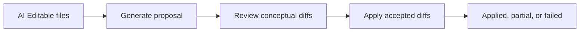

# kiss_ai Web Source Architecture

This directory is organized so AI agents can add features without growing a single app file.

## Module Map

```text
src/
  app/        App shell, theme mapping, and workspace orchestration
  contracts/  Shared API request/response shapes
  data/       Backend API transport helpers
  domain/     Pure helpers for files, links, diffs, design identity parsing, formatting
  editor/     CodeMirror React wrapper and editor extensions
  features/   User-facing workflow components
  navigation/ Route, view, and navigation models
  shared/     App-neutral shared UI components and types
```

## App Layer

`main.tsx` imports the app shell from `app/App.tsx`.

`app/App.tsx` composes the shell, sidebar, and active workflow. It should read like the map of the UI. Keep data loading, route application, saving, reverting, rebuild polling, and project selection in `app/useProjectWorkspace.ts`.

`navigation/views.ts` owns view ids, route-backed view metadata, local storage keys, and file-path-to-view policy. Route hash behavior belongs in `navigation/routes.ts`.

App-owned orchestration belongs in `app/`. If state drives more than one workflow surface, keep the controller in `app/` or a focused `app/hooks/` module and pass behavior into features as props.

Right-panel behavior is app shell state. Panel persistence, panel width, selected agent conversation mirroring, and file context selection belong in `app/`; the panel UI belongs in `features/agents/`.

`app/useProjectWorkspace.ts` owns the shared `projectFiles` index used by navigation, editor link resolution, and agent file context selection. View-specific file content stays in the selected file state; features should not maintain a parallel project tree unless the data is truly local to that workflow.

Shared UI components such as chat message rendering live under `shared/`, while feature directories own workflow-specific composition.

## Domain Layer

Use `domain/` for deterministic helpers that can be understood and tested without React:

- `designIdentity.ts`: parse and serialize `human_design_identity.md`.
- `diffs.ts`: line diff calculations and diff counts.
- `files.ts`: file trees, file de-duplication, and path display helpers.
- `formatters.ts`: date and display formatting helpers.
- `links.ts`: wiki/markdown link resolution and display helpers.

Domain modules should not import React, components, hooks, CodeMirror widgets, app view types, or transport clients. They may import API contract types from `contracts/api.ts`.

## Editor Layer

Use `editor/` for CodeMirror-specific behavior:

- `MarkdownEditor.tsx`: React wrapper for the configured editor.
- `MarkdownEditor.css`: CodeMirror wrapper, diff, wiki link, and base table editor styles.
- `diffExtension.ts`: saved and unsaved diff decorations.
- `wikiLinkExtension.ts`: clickable wiki and markdown links.
- `markdownTableExtension.ts`: table editing extension public API.
- `markdownTableExtension.css`: table interaction styling, including handles, selection, active cells, and context menus.

Editor modules may import domain helpers and API contract types. They should receive app behavior through callbacks rather than importing workflow components or transport clients.

## Feature Layer

Use `features/<feature>/` for workflow UI. A feature component can own local UI state, but app-wide state and API orchestration should stay in `useProjectWorkspace.ts` and focused hooks under `app/hooks/`. Feature-local API calls are acceptable for isolated interactions, such as debounced search in `features/search/GlobalFileSearch.tsx`, when the result does not become shared workspace state.

`features/navigation/` is shell-adjacent UI: it may consume `navigation/` metadata, but it should not import from `app/`, own route parsing, local storage behavior, or data loading.

Current features:

- `agents/`
- `buildLog/`
- `chat/`
- `dashboard/`
- `design/`
- `files/`
- `navigation/`
- `projectPicker/`
- `rebuild/`
- `search/`
- `toast/`

## Data And Live Updates

Use `contracts/` for shared API shapes and `data/` for transport helpers. Server request validation lives in `server/routes/requestSchemas.js`; when adding or changing an API shape, update the contract type, transport helper, route schema, and focused tests together.

Chat and rebuild workflows use a dual transport:

- A REST request starts or mutates the workflow.
- An `EventSource` stream sends live snapshots and deltas.
- Polling or a fresh REST read should remain a recovery path for stream disconnects.

Long-running server work should have an explicit lifecycle state. Rebuilds persist state under `.runtime/`; chat conversations persist messages under the project and should normalize stale streaming messages when recovered.

## AI Edit Proposal Flow

The right-panel chat can turn a user guidance message plus selected AI Editable files into per-file Proposed Changes. The frontend keeps shared conversation state and API orchestration in `app/hooks/useProjectChat.ts`; `features/agents/RightPanelAgentChat.tsx` owns the review UI for accepting or rejecting conceptual diffs.

This section is the source map for the web implementation. The durable protocol contract lives in [`/opt/all_hail_ai/kiss_ai/docs/development/concepts/agent-protocol-edit-proposals.md`](/opt/all_hail_ai/kiss_ai/docs/development/concepts/agent-protocol-edit-proposals.md).

Proposal requests use the chat route stack: `contracts/api.ts` defines request/response shapes, `data/chatApi.ts` transports them, `server/routes/chatRoutes.js` validates them, and `server/services/chatAgent.js` builds the agent prompts and persists proposal metadata on the conversation.

The lifecycle is:



Conceptual diffs are read-only in v1: users accept or reject them, then the server runs a constrained local Cursor agent to edit approved files directly on disk. Context files remain read-only unless the same path is also selected as AI Editable and has an accepted conceptual diff. Rejected conceptual diffs are sent to apply runs as explicit negative constraints.

Applied proposal state remains in conversation-level `editProposals` and links back to the originating user message with `sourceMessageId`. The chat thread renders compact applied-proposal chips on those messages, while the large proposal review card hides fully applied proposals unless a chip reopens the read-only details.

Only one Cursor agent task may run per project at a time. Chat, proposal, apply, rebuild, and human-attention resolution flows share the project agent lock; UI controls should reflect loading, sending, and proposal-update states.

## Quality Gate

Run `npm run check` from `web/` before handing off substantive changes. It runs app TypeScript, server TypeScript, boundary checks, and Vitest.

`scripts/check-boundaries.js` is the import boundary gate. Keep it aligned with this document when adding layers, moving workflow ownership, or allowing a deliberate exception.

## Adding A New Workflow

1. Add the view id and label in `navigation/views.ts`.
2. Add route/data loading behavior in `app/useProjectWorkspace.ts` or a focused hook under `app/hooks/`.
3. Add the root component under `features/<feature>/`.
4. Compose the feature in `app/App.tsx`.
5. Run `npm run check` from `web/`.

Keep each step narrow and behavior-preserving.
