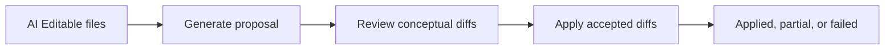

# kiss_ai Web Source Architecture

This is maintainer documentation for people changing the primary local web application. External users should start with [`../../README.md`](../../README.md).

This directory is organized so AI agents can add features without growing a single app file.

This is an AI-coded, AI-managed, and AI-developed web app. Architecture, code,
documentation, naming, and tests should optimize for future AI maintainability:
clear boundaries, local contracts, progressive discovery, and small safe changes
matter more than clever abstractions.

## AI Maintainer Protocol

Start here before changing `src/`. Treat this file as the local source of truth
for web architecture, then follow the referenced files for the workflow you are
touching. When implementation and documentation disagree, either update the stale
source in the same change or stop and identify the mismatch for review.
For hub runtime settings, repo boundaries, and project-root assumptions outside
`src/`, read `../LAB_NOTES.md`.

Prefer changes that are easy for the next AI agent to verify:

- Keep behavior close to its documented owner.
- Preserve import boundaries unless a boundary change is the purpose of the work.
- Update API contract types, transport helpers, server schemas, and focused tests
  together when an API shape changes.
- Leave large orchestration splits, protocol rewrites, and cross-feature
  refactors for explicit review unless the user requested that maneuver.
- Document new workflow entry points here so future agents can progressively
  discover the right files instead of searching the whole app.

## Module Map

```text
src/
  app/        App shell, theme mapping, and workspace orchestration
  contracts/  Shared API request/response shapes (domain-split sub-modules)
  data/       Backend API transport helpers (domain-specific modules)
  domain/     Pure helpers for files, links, diffs, design identity parsing, formatting
  editor/     CodeMirror React wrapper and editor extensions
  features/   User-facing workflow components
  navigation/ Route, view, and navigation models
  shared/     App-neutral shared UI components and types
  styles/     CSS per feature, design tokens, reset, and responsive utilities
```

## App Layer

`main.tsx` imports the app shell from `app/App.tsx`.

`app/App.tsx` composes the shell, sidebar, and active workflow. It should read like the map of the UI. Business logic for chat file edits, renames, topic creation, and file assist is extracted into `app/hooks/useChatActions.ts`. Keep data loading, route application, saving, reverting, rebuild polling, and project selection in `app/useProjectWorkspace.ts`.

Global hub actions that are not scoped to a research project should use `/api/system/*` routes. The current example is the dashboard **Get latest** action, which calls `data/systemApi.ts`, runs guarded server-side Git update logic in `server/services/kissAiUpdate.js`, and leaves project-local Git histories untouched.

`navigation/views.ts` owns view ids, file-backed view policy, local storage keys, and file-path-to-view policy. Route hash behavior belongs in `navigation/routes.ts`; user-facing navigation labels belong in `navigation/navigationModel.ts` or the composing feature.

App-owned orchestration belongs in `app/`. If state drives more than one workflow surface, keep the controller in `app/` or a focused `app/hooks/` module and pass behavior into features as props.

`app/ReviewWorkspace.tsx` composes `features/questions/` and `features/topics/` into a unified tabbed view called "AI Review". It lives in `app/` rather than `features/` because it crosses feature boundaries to compose the two review surfaces plus a "Needs Attention" summary dashboard with topic progress and question counts.

Right-panel behavior is app shell state. Panel persistence, panel width, panel kind, selected agent conversation mirroring, mode switching, and file context selection belong in `app/`. `features/agents/` owns the AI File Assist / agent chat panel body.

`app/useProjectWorkspace.ts` owns the shared `projectFiles` index used by navigation, editor link resolution, and agent file context selection. View-specific file content stays in the selected file state; features should not maintain a parallel project tree unless the data is truly local to that workflow.

Shared UI components such as chat message rendering live under `shared/`, while feature directories own workflow-specific composition.

## Domain Layer

Use `domain/` for deterministic helpers that can be understood and tested without React:

- `designIdentity.ts`: parse and serialize `human_design_identity.md`.
- `diffs.ts`: line diff calculations and diff counts.
- `errors.ts`: shared error-message extraction.
- `files.ts`: file trees, file de-duplication, and path display helpers.
- `formatters.ts`: date and display formatting helpers.
- `conversation.ts`, `humanAttention.ts`, and `rebuild.ts`: deterministic workflow state helpers.
- `links.ts`: wiki/markdown link resolution and display helpers.
- `modelLabels.ts`: model display labels, tier labels, grouping, and sorting.
- `projectPaths.ts`: project path constants and path classification policy.


Domain modules should not import React, components, hooks, CodeMirror widgets, app view types, or transport clients. They may import API contract types from `contracts/api.ts` or its domain sub-modules.

## Contracts Layer

`contracts/api.ts` is a barrel that re-exports all types from domain-focused sub-modules. Downstream code can import from `contracts/api` for convenience, or directly from the sub-module for tighter coupling:

- `contracts/rebuild.ts`: rebuild state, agent run events, build questions, attention items
- `contracts/chat.ts`: chat messages, conversations, conceptual diffs, edit proposals
- `contracts/topics.ts`: topics, topic state, disposition, create/response shapes
- `contracts/artifacts.ts`: artifact specs and source files
- `contracts/buildLog.ts`: build log tabs, files, and state
- `contracts/project.ts`: project status, files, file content, design state
- `contracts/auth.ts`: authentication types
- `contracts/system.ts`: version, update, settings, keybindings
- `contracts/agents.ts`: agent context file types (used by chat and rebuild)

## Data Layer

Transport helpers are domain-specific modules. There is no aggregated API client — each module exports its own namespace object:

- `data/authApi.ts`, `data/chatApi.ts`, `data/filesApi.ts`, `data/projectsApi.ts`, `data/rebuildApi.ts`, `data/systemApi.ts`, `data/artifactsApi.ts`

## Editor Layer

Use `editor/` for CodeMirror-specific behavior:

- `MarkdownEditor.tsx`: React wrapper for the configured editor.
- `MarkdownEditor.css`: CodeMirror wrapper, diff, wiki link, and base table editor styles.
- `diffExtension.ts`: saved and unsaved diff decorations.
- `wikiLinkExtension.ts`: clickable wiki and markdown links.
- `annotationExtension.ts`: annotation markers and inline annotation rendering.
- `annotationExtension.css`: annotation styling.
- `markdownTableExtension.ts`: table editing extension public API.
- `markdownTableExtension.css`: table interaction styling, including handles, selection, active cells, and context menus.

Editor modules may import domain helpers and API contract types. They should receive app behavior through callbacks rather than importing workflow components or transport clients.

## Feature Layer

Use `features/<feature>/` for workflow UI. A feature component can own local UI state, but app-wide state and API orchestration should stay in `useProjectWorkspace.ts` and focused hooks under `app/hooks/`. Feature-local API calls are acceptable for isolated interactions, such as debounced search in `features/search/GlobalFileSearch.tsx`, when the result does not become shared workspace state.

`features/navigation/` is shell-adjacent UI: it may consume `navigation/` metadata, but it should not import from `app/`, own route parsing, local storage behavior, or data loading.

Feature modules must not import sibling feature implementations. If two features
need the same behavior, move the shared primitive to `domain/`, `shared/`, or an
app-owned controller, depending on whether it is pure logic, reusable UI, or
workspace orchestration.

Current features:

- `agents/` (sub-components: `AgentConversationHeader`, `AgentEditProposalPanel`, `agentChatHelpers`)
- `artifacts/`
- `chat/`
- `dashboard/`
- `design/`
- `files/`
- `navigation/`
- `projectPicker/`
- `questions/` (composed via `app/ReviewWorkspace.tsx`)
- `rebuild/`
- `search/`
- `toast/`
- `topics/` (sub-components: `TopicCard`, `topicHelpers`; composed via `app/ReviewWorkspace.tsx`)

## Styles Layer

`styles/01-tokens.css` defines the design token system:

- **Colors**: semantic palette (primary, accent, surface, border, status)
- **Spacing**: 4px-base scale (`--space-1` through `--space-12`)
- **Typography**: font families, size scale, line heights, font weights
- **Radius**: `--radius-sm` through `--radius-full`
- **Shadows**: `--shadow-sm`, `--shadow-md`, `--shadow-lg`, `--shadow-inset`
- **Transitions**: `--transition-fast`, `--transition-normal`, `--transition-slow`

Feature CSS files should prefer token variables over hardcoded values for border-radius, spacing, and typography.

## Data And Live Updates

Use `contracts/` for shared API shapes and `data/` for transport helpers. Server request validation lives in `server/routes/requestSchemas.js`; when adding or changing an API shape, update the contract type in the appropriate contract sub-module, transport helper, route schema, and focused tests together.

Chat and rebuild workflows use a dual transport:

- A REST request starts or mutates the workflow.
- An `EventSource` stream sends live snapshots and deltas.
- Polling or a fresh REST read should remain a recovery path for stream disconnects.

Long-running server work should have an explicit lifecycle state. Rebuilds persist state under `.runtime/`; chat conversations persist messages under the project and should normalize stale streaming messages when recovered.

## Conceptual Diff File Edit Protocol

Conceptual diffs are the first-class review contract for AI file edits in the local web UI. A proposal agent describes intended file changes as conceptual diffs; the human accepts or rejects those diffs; an apply agent may then edit only the approved targets while treating rejected diffs as negative constraints.

The right-panel chat and AI File Assist are implementations of this protocol. Rejection memory ensures previously rejected conceptual intent is treated consistently across proposal runs.

Start here for the current protocol contract. Keep this section aligned with the implementation whenever proposal, review, or apply behavior changes.

The frontend keeps shared conversation state and API orchestration in `app/hooks/useProjectChat.ts`; `features/agents/RightPanelAgentChat.tsx` owns the AI File Assist conversation composition. Shared conceptual diff review primitives live under `shared/conceptualDiff/`.

Proposal requests use route-specific stacks. `contracts/api.ts` defines shared request/response shapes. AI File Assist uses `data/chatApi.ts`, `server/routes/chatRoutes.js`, and `server/services/chatAgent.js`. `FRAMEWORK_ROOT` defaults to `_kiss_ai/framework` in this workspace layout and can be overridden with `KISS_AI_FRAMEWORK_ROOT`. Shared conceptual diff parsing lives in `server/services/conceptualDiffs.js`; shared rejection memory lives in `server/services/conceptualDiffMemory.js`.

The lifecycle is:



Conceptual diffs are read-only review artifacts: users accept or reject them, then the server runs a constrained local Cursor agent to edit approved files directly on disk. The compact review surface is title and summary, with expandable details for scope, intent, evidence, preservation constraints, non-goals, risk, and reconsideration memory. Context files remain read-only unless the same path is also selected as AI Editable and has an accepted conceptual diff. Rejected conceptual diffs are sent to apply runs as explicit negative constraints.

Rejected conceptual diffs are also persisted as soft project memory. Future proposal prompts receive relevant active memory for the selected editable files, suppressing exact repeats unless changed evidence or explicit user guidance justifies reconsideration. Reconsidered diffs show a small “Previously rejected” badge and explanation when available.

Applied proposal state remains in conversation-level `editProposals` and links back to the originating user message with `sourceMessageId`. The chat thread renders compact applied-proposal chips on those messages, while the large proposal review card hides fully applied proposals unless a chip reopens the read-only details.

Only one Cursor agent task may run per project at a time. Chat, proposal, apply, rebuild, and human-attention resolution flows share the project agent lock; UI controls should reflect loading, sending, and proposal-update states.

## Quality Gate

Run `npm run check` from `web/` before handing off substantive changes. It runs app TypeScript, server TypeScript, boundary checks, and Vitest.

`scripts/check-boundaries.js` is the import boundary gate. Keep it aligned with this document when adding layers, moving workflow ownership, or allowing a deliberate exception.

The boundary gate intentionally checks static imports only and skips `*.test.*` / `*.spec.*` files. It enforces feature isolation, pure-ish domain/editor/navigation/shared layers, a thin `main.tsx`, and server filesystem/process/Cursor SDK ownership. It does not currently forbid every possible layer edge, such as `app/` importing `data/`, `data/` importing `navigation/`, or `domain/` importing `navigation/`; document or tighten those edges only when the architecture needs that stronger guarantee.

Use this checklist before adding an import:

- `main.tsx` stays a thin entrypoint.
- `contracts/` imports only other contract modules.
- `domain/` does not import React, app, feature, editor, or transport modules.
- `editor/` receives app behavior through callbacks and does not import data
  clients.
- `navigation/` owns route and view policy without importing UI workflows.
- `shared/` remains app-neutral and does not call APIs.
- `features/` do not import `app/` or other feature implementations.
  Exception: features may import from `app/contexts/` to consume shared
  React Contexts (e.g., toast, build state, route context).
- `app/` may compose root-level feature entrypoints, but should not reach into
  deeper feature implementation subdirectories.
- Server routes use services; approved service/runtime modules own filesystem,
  process, and Cursor SDK access.

Allowed-but-watchful edges should stay rare and intentional. In particular, keep
`app/` to `data/` imports inside workspace controllers and hooks, avoid `data/`
depending on route/view policy, and avoid `domain/` depending on `navigation/`
unless the helper is truly cross-cutting project policy.

## Deferred Component Decomposition

These components are architecturally compliant (correct boundaries, correct layer)
but larger than ideal. They should be decomposed **opportunistically** — when the
next substantive change touches one, split it as part of that work rather than as
a standalone refactor.

### When to split

Split a component from this list when:

- You are adding a new section, panel, or interaction mode to the component.
- You are fixing a bug that requires understanding more than half the file.
- The component crosses 800 lines after your change.

Do **not** split proactively without a triggering change — the agent doing the
split needs live context on what the component actually does.

### How to split

Follow the pattern established in the June 2026 architecture cleanup:

1. Extract pure helper functions into a `<feature>Helpers.ts` sibling module.
2. Extract the largest self-contained JSX region into a named component file.
3. Keep the root component as orchestration — hooks, state, callbacks — composing
   the extracted sub-components via props.
4. Run `npm run check` after each extraction.
5. Update this section to remove the resolved item.

### Remaining components

| Component | Lines | Suggested extraction |
|-----------|-------|---------------------|
| `features/navigation/WorkflowSectionMenu.tsx` | ~660 | Helper components → separate files if adding new section types |
| `features/artifacts/ArtifactsView.tsx` | ~660 | Detail editor → `ArtifactDetailEditor.tsx`; list panel → `ArtifactListPanel.tsx` |
| `features/navigation/FileTreeNav.tsx` | ~540 | Tree node → `FileTreeNode.tsx`; drag-drop → `useFileTreeDragDrop.ts` |
| `features/questions/QuestionsWorkspace.tsx` | ~520 | Question card → `QuestionCard.tsx`; AI assist panel → `QuestionAiAssist.tsx` |
| `features/design/DesignWorkspace.tsx` | ~390 | Near target size — split only if adding sections |
| `features/rebuild/BuildProjectRightPanel.tsx` | ~380 | Near target size — split only if adding sections |

### Server-side deferred items

These are outside the front-end `src/` tree and should be addressed in a separate
server-focused review:

- `server/services/agentJobs.js`: rebuild, deepen, and artifact build pipeline orchestration.
- `server/services/artifactService.js`: artifact spec CRUD, source resolution, prompt templates, and auto-generation.

## Adding A New Workflow

1. Add the view id in `navigation/views.ts` and any user-facing label in `navigation/navigationModel.ts` or the composing feature.
2. Add route/data loading behavior in `app/useProjectWorkspace.ts` or a focused hook under `app/hooks/`.
3. Add the root component under `features/<feature>/`.
4. Compose the feature in `app/App.tsx`.
5. Run `npm run check` from `web/`.

Keep each step narrow and behavior-preserving.
